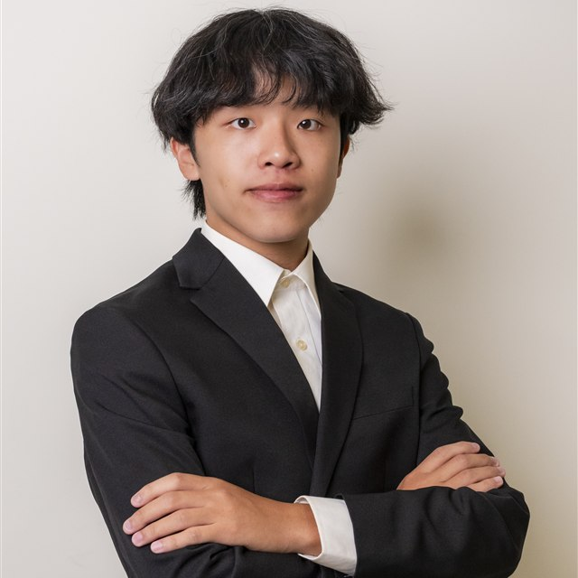

  

  <strong>CSIE @ NCUE · Research Intern @ ITRI</strong>  
  <a href="https://xn--zwq108c.tw/research/">Academic Profile</a> ·
  <a href="https://xn--zwq108c.tw/research/assets/Chieh-Lun-Yang-Resume.pdf">CV</a> ·
  <a href="https://www.linkedin.com/in/chieh-lun-yang/">LinkedIn</a> ·
  <a href="mailto:cl.yang04@gmail.com">Email</a>

<table>
  <tr>
    <td width="32%" align="center">
      
    </td>
    <td width="68%">
      <h3>✨ A little about me</h3>
      🎓 CS student exploring computer vision and applied AI.  
      🚀 Dreaming about space and what lies beyond Earth.  
      💡 Always curious about emerging technology and IT.  
      📷 I enjoy photography and capturing everyday moments.  
      🏃 Running and sports keep me moving.  
      🍜 Always happy with a good bowl of ramen.
    </td>
  </tr>
</table>

## 💼 Experience

- **Industrial Technology Research Institute (ITRI)** — Research Intern · Oct. 2026–Present
- **TMY Technology (TMYTEK)** — Research & Development Intern · Jul. 2026–Present
- **TPV Technology** — IT / Software Validation Intern · Jul.–Aug. 2025
